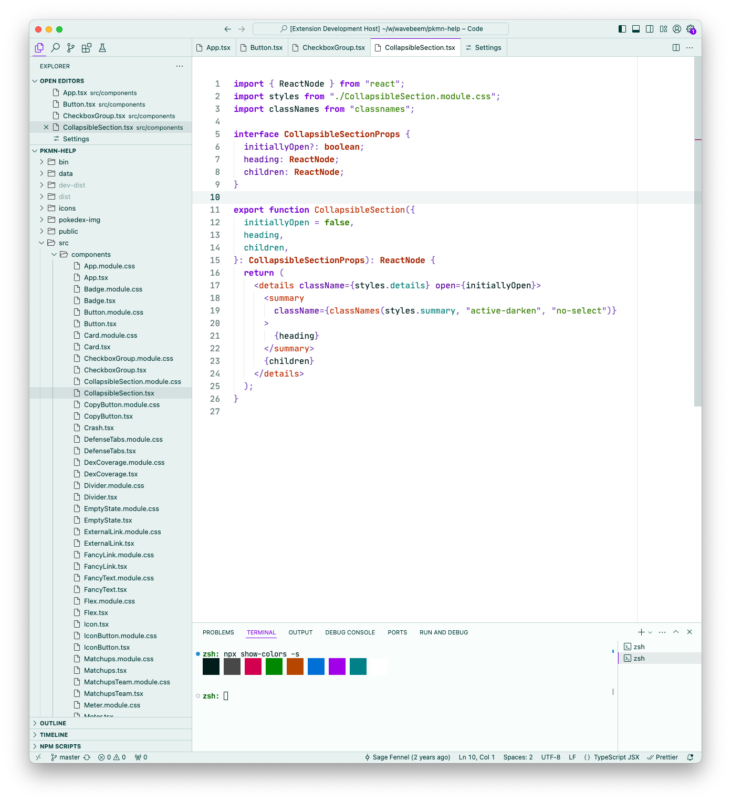

# Sage of Light Theme

> For Visual Studio Code

A light theme based on teal, purple, orange, and green.

Designed to be used in a well-lit environment.



## License

[MIT](LICENSE)

---

## Development

### Get a new personal access token (PAT)

https://code.visualstudio.com/api/working-with-extensions/publishing-extension#get-a-personal-access-token

### Azure DevOps organization

https://wavebeem.visualstudio.com/

### Releasing a new version

```
$ npm version X.Y.Z
```

If this fails, you can run `npm run postversion` again
